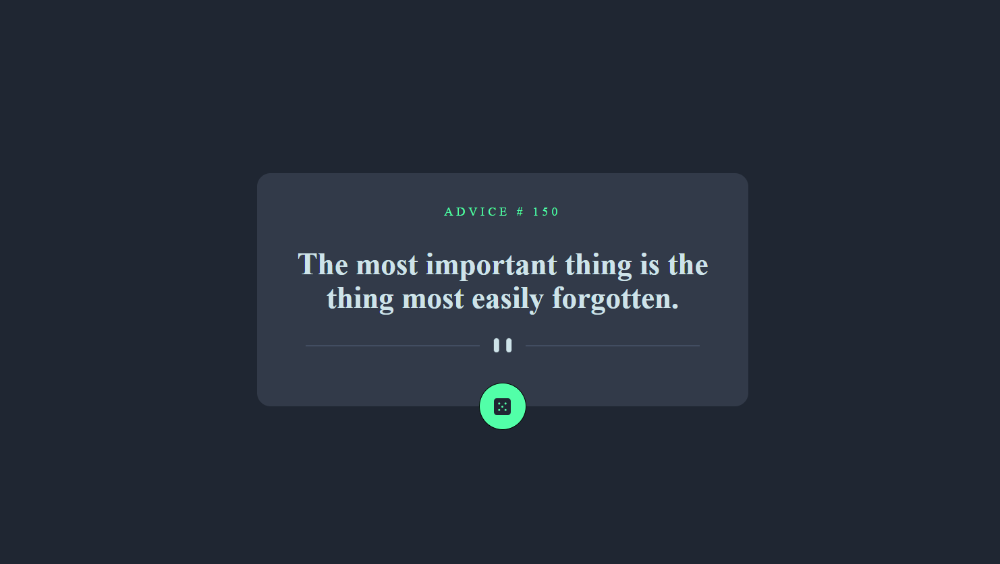

# Advice generator app solution

This is a solution to the [Advice generator app challenge on Frontend Mentor](https://www.frontendmentor.io/challenges/advice-generator-app-QdUG-13db). Frontend Mentor challenges help you improve your coding skills by building realistic projects.

## Table of contents

- [Overview](#overview)
  - [The challenge](#the-challenge)
  - [Screenshot](#screenshot)
  - [Links](#links)
- [My process](#my-process)
  - [Built with](#built-with)
  - [What I learned](#what-i-learned)
  - [Continued development](#continued-development)
  - [Useful resources](#useful-resources)
- [Author](#author)
- [Acknowledgments](#acknowledgments)

## Overview

### The challenge

The challenge wass to build out this advice generator app using the [Advice Slip API](https://api.adviceslip.com) and using NextJS, React, TypeScript and TailwindCSS to create application and get it looking as close to the design as possible.

Users should be able to:

- View the optimal layout for the app depending on their device's screen size
- See hover states for all interactive elements on the page
- Generate a new piece of advice by clicking the dice icon

### Screenshot

Links

- Solution URL: https://github.com/SwallowEve/Advice-generator-app
- Live Site URL: [Add live site URL here](https://your-live-site-url.com)

## My process

### Built with

- Semantic HTML5 markup
- CSS custom properties
- TailwindCSS
- Mobile-first workflow
- [React](https://reactjs.org/) - JS library
- [Next.js](https://nextjs.org/) - React framework
- TypeScript

### Useful resources

- https://tailwindcss.com/docs/installation - All needed information about Tailwind, including predefined classes and 'How-to' for customisation
- https://blog.logrocket.com/import-svgs-next-js-apps/ - This is an amazing article which helped me to configure  SVG files usage in React
- https://www.freecodecamp.org/news/how-to-validate-forms-in-react/ - A good helper to tune form validation in React
- https://www.positronx.io/react-send-data-from-child-to-parent-component-tutorial/ - An articlewith clear instructions of passing props from child to parent component
- https://www.codehim.com/date-time/javascript-calculate-age-in-years-months-days/ - I used this concept for age calculation

## Author

- Website - [https://swalloweve.github.io/portfolio/](https://swalloweve.github.io/portfolio/)
- Frontend Mentor - @SwallowEve
